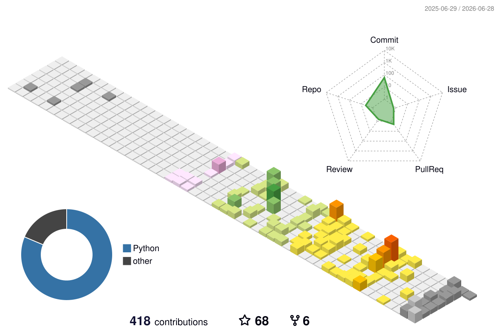

  

## About Me

- 2022~2026, **EE -> CS**  @ XMU
- 2026~present, Master's Student in Electronic Information @ SJTU

## More About Me

- Blog: [wegret's blog](https://wegret.github.io/)
- Codeforces: [@wlaten](https://codeforces.com/profile/wlaten) 

<!--  -->

## Stats

 

<!--

-->

<!-- <picture>
  <source media="(prefers-color-scheme: light)" srcset="https://raw.githubusercontent.com/wegret/wegret/output/github-contribution-grid-snake.svg">
  <source media="(prefers-color-scheme: dark)" srcset="https://raw.githubusercontent.com/wegret/wegret/output/github-contribution-grid-snake-dark.svg">
  
</picture> -->

<!--

-->
